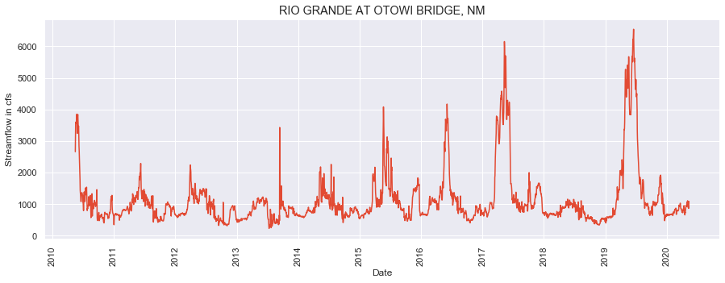
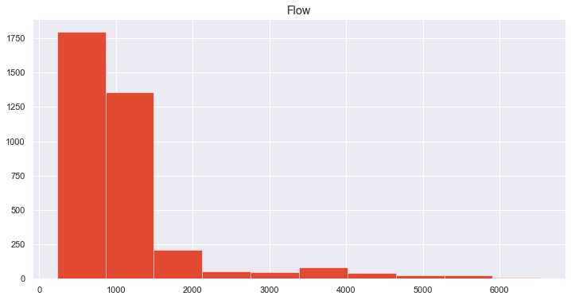
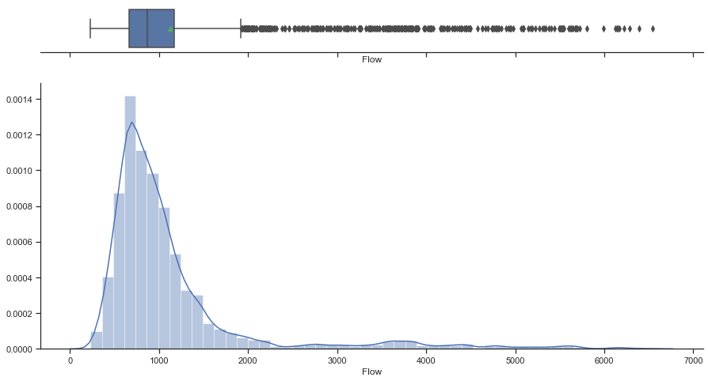
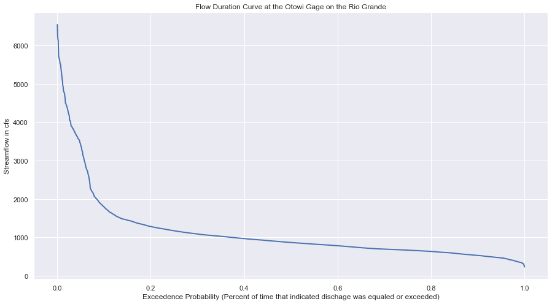
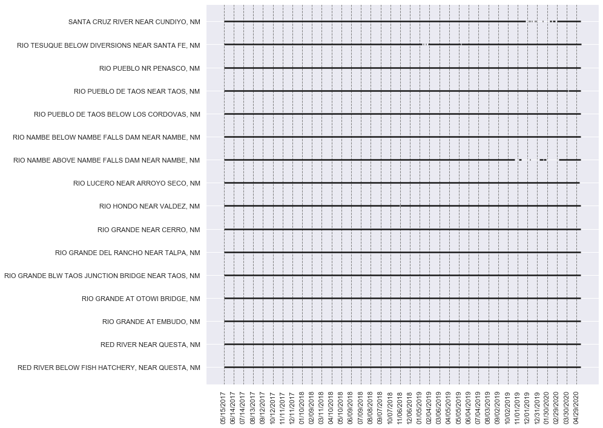
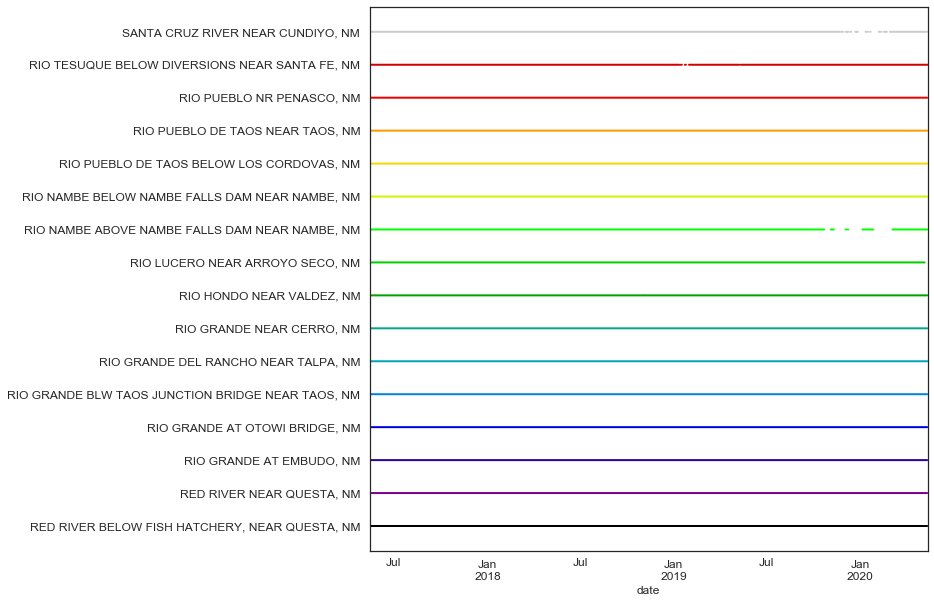

# Obtaining Hydrology Data with the Climata Python Package

I highly recommend you take a look at the [__Climata__](https://github.com/heigeo/climata) documentation before going too much further.  In essence, Climata allows you to easily interface with, and retrieve hydrology datasets from some prominent state and government organizations.  

To start, we will extract data for a single USGS gaging station. On the website, linked above, you can scroll down and find a table titled "Available Services"  This has important information of how you go about requesting the data from each organization.  We want USGS streamgage data so we use the class "DailyValueIO" when importing the Climata packages.

__Note:__  You could also accomplish something similar using the python package [__ulmo__](https://ulmo.readthedocs.io/en/latest/).  For this tutorial we will only focus on climata.


```python
# Extract data for one USGS gaging station

import matplotlib
import matplotlib.pyplot as plt
from climata.usgs import DailyValueIO  # Import the relevant CLIMATA package
import pandas as pd
from pandas.plotting import register_matplotlib_converters
import numpy as np
import seaborn as sns

# this designates the plot style and the width, height of the figure. 
register_matplotlib_converters()
plt.style.use('ggplot')
plt.rcParams['figure.figsize'] = (12.0, 6.0)
```

## USGS Streamflow Data
- Next we want to select our USGS gaging station.  Navigate [here](https://waterdata.usgs.gov/nwis/rt) to find the streamgage number you want.  For this demonstration, I have selected the __Otowi gage__ on the Rio Grande in New Mexico.  

- After that, we need our "parameter id", which in my case is found [here](https://waterdata.usgs.gov/nm/nwis/dv?referred_module=sw&site_no=08313000).  The parameter id 00060 gives mean daily discharge values (in cubic feet per second).  Then we construct the appropriate list of dates we need for this timeseries.  This will extend from from the present day to the specified number of years in the past.  After that we specify the data paramter to pull out the data given out stations number, parameter ID, and date range.


```python
# Next, we want to set the requisite parameters.

nyears = 10              # You can change this parameter to adjust how many years back you want to fetch data.
ndays = 365 * nyears
station_id = "08313000"  # USGS gaging station ID
param_id = "00060"       # Mean daily discharge parameter

# Construct the appropriate list of dates we need for this timeseries 
# that extends from the present day to the specified number of years in the past.

datelist = pd.date_range(end=pd.datetime.today(), periods=ndays).tolist()

# Specify which dates we want to pull out of the dataset based on the datelist we outlined above
data = DailyValueIO(
    start_date=datelist[0],
    end_date=datelist[-1],
    station=station_id,
    parameter=param_id,)

print(data)
```

    <climata.usgs.DailyValueIO object at 0x0000024511084DC8>
    

The next step involves constructing a for loop, which will look through the data (established by the "data" parameter previously) and pull out all of the dates and flows within the dataset respective lists.  This for loop also takes advantage of list comprehensions (eg. flow = [r[1] for r in stream.data]), which I recommend you look up if you are like me and have a limited programming background.


```python
# Climata gives this example for displaying site information and time series data, using a traditional for loop.
#for stream in data:
    #print(stream.data)
    #for r in stream.data:
        #print(r[1])
    #for r in stream.data:
        #print(r[0])

# A more concise way of creating lists of date-flow values and putting them in a list is demonstrated below.
for stream in data:
    flow = [r[1] for r in stream.data]   #If you need, I recommend looking up list comprehensions.
    dates = [r[0] for r in stream.data]

#print(flow) 
#print(dates)  # check and see what the lists look like

# Let's combine the two lists to make a single dataframe!  That way, we can conveniently manipulate
# the data in pandas and , if we want, eventually export this to a csv, or excel file.  
# Note: All flows here are given in cubic feet per second, which is generally standard unit of 
# measure in USGS steamflow datasets.

df = pd.DataFrame({'date': dates, 
                   'Flow': flow})
print(df.head)
```

    <bound method NDFrame.head of            date   Flow
    0    2010-03-06  786.0
    1    2010-03-07  791.0
    2    2010-03-08  852.0
    3    2010-03-09  883.0
    4    2010-03-10  901.0
    ...         ...    ...
    3644 2020-02-26  766.0
    3645 2020-02-27  676.0
    3646 2020-02-28  720.0
    3647 2020-02-29  819.0
    3648 2020-03-01  802.0
    
    [3649 rows x 2 columns]>
    

## Cleaning and Plotting the Data

Now lets take a look at the dataframe we put together and check for any missing and/or null values.  The data cleaning you need to do will be unique to your data source and dataset; there are many situations that arise that may require other methods that to investigate and clean the data.  Fortunatley for us, the USGS streamgage data is typically in pretty good shape for most gages.  

__Note__:  The most recent data (about a month prior to the present day) undergoes a "provisional data" period before it becomes a "period of approved data".  Keep that in mind before you decide to analyze a particular timeframe of streamflow data.  In our case, we will pretent that the provisional data is "approved data" for simplicity.


```python
# I like to use one or all of the below print paramters to check out the dataset and look for any red flags
# within the dataframe.  If we notice any NaN values, empty cells, etc. we will need to clean our data before
# working with it.

print(df.dtypes)
print(df.tail())
print(df.describe())
print(df.shape)
print(df.isnull().values.any())  #check for any null values in the timeseries
print(df.isnull().sum())

# Call the plot commands to produce the hydrograph for the Otowi gage.
sns.set_style("darkgrid")
fig, ax = plt.subplots(figsize=(15,5))
plt.plot(df['date'],df['Flow'])
plt.xlabel('Date')
plt.ylabel('Streamflow in cfs')
plt.title(stream.site_name)
plt.xticks(rotation='vertical')
plt.show()

# Quick histogram plot.
print(df.hist())
```

    date    datetime64[ns]
    Flow           float64
    dtype: object
               date   Flow
    3644 2020-02-26  766.0
    3645 2020-02-27  676.0
    3646 2020-02-28  720.0
    3647 2020-02-29  819.0
    3648 2020-03-01  802.0
                  Flow
    count  3649.000000
    mean   1156.173198
    std     929.894496
    min     232.000000
    25%     668.000000
    50%     876.000000
    75%    1200.000000
    max    6540.000000
    (3649, 2)
    False
    date    0
    Flow    0
    dtype: int64
    





    [[<matplotlib.axes._subplots.AxesSubplot object at 0x0000024516ED0DC8>]]
    





## Distribution of Streamflow Values

First, let's the distrubution of streamflow at the Otowi Gage in New Mexico.  We can do this with matplotlib or seaborn; in this case I opt for seaborn.


```python
import numpy as np
import seaborn as sns
import matplotlib.pyplot as plt

sns.set(style="ticks")
x=df['Flow']

f, (ax_box, ax_hist) = plt.subplots(2, sharex=True, 
                                    gridspec_kw={"height_ratios": (.15, .85)}, figsize=(15, 8))

sns.boxplot(x, ax=ax_box, showmeans=True)
sns.distplot(x, ax=ax_hist)

# Remove the border around the figures
ax_box.set(yticks=[])
sns.despine(ax=ax_hist)
sns.despine(ax=ax_box, left=True)
```





## Plot Flow Duration Curve

Flow duration curves are defined using the following equation:

__P = 100 * [ M / (n + 1) ]__

where:
- __P__ = the probability that a given flow will be equaled or exceeded (% of time)
- __M__ = the ranked position on the listing (dimensionless)
- __n__ = the number of events for period of record (dimensionless)


```python
df['pct_rank'] = df['Flow'].rank(ascending=False,pct=True)
df['pct_rank'] = df['pct_rank']
df = df.sort_values(by=['pct_rank'])
print(df.head())

sns.set_style("darkgrid")
fig, ax = plt.subplots(figsize=(15,8))
plt.plot(df['pct_rank'], df['Flow'], linewidth=2.0)
plt.xlabel('Exceedence Probability (Percent of time that indicated dischage was equaled or exceeded)')
plt.ylabel('Streamflow in cfs')
plt.title('Flow Duration Curve at the Otowi Gage on the Rio Grande')
```

               date    Flow  pct_rank
    3391 2019-06-18  6540.0  0.000274
    3390 2019-06-17  6390.0  0.000548
    3389 2019-06-16  6280.0  0.000822
    3387 2019-06-14  6220.0  0.001096
    3392 2019-06-19  6170.0  0.001370
    


    Text(0.5, 1.0, 'Flow Duration Curve at the Otowi Gage on the Rio Grande')





## Query with FIPS Code

We can also query the data using Federal Information Processing Standard (FIPS) county codes.  You can find a complete list of FIPS county codes [here](https://www.nrcs.usda.gov/wps/portal/nrcs/detail/national/home/?cid=nrcs143_013697) and pick the one you desire.  For this demonstration I selected the Santa Fe County FIPS code. 

If you run the code below, and exclude the site name filter, you will get a long list of items.  For this example, let's say we do not want the piezometers or the items that have numbers for the site names (meaning we only want USGS stream gage data).  To exclude the piezometers, we can maintain site names that only have upper case letters.  Then, we can exclude the site names that have numbers for their label.  This will leave us with site names that are consistent with streamgages from the USGS.


```python
#%%  Extract Data using FIPS code
# Set the parameters
nyears = 1
ndays = 365 * nyears
county = "35049"  # Enter FIPS code for county
datelist = pd.date_range(end=pd.datetime.today(), periods=ndays).tolist()

data = DailyValueIO(
    start_date=datelist[0],
    end_date=datelist[-1],
    county=county)

date = []
value = []

# Get the date and values into list using traditional for loop
for series in data:
    for row in series.data:
        date.append(row[0])
        value.append(row[1])
        
site_names = [[series.site_name] * len(series.data) for series in data]
station_id = [[series.site_code] * len(series.data) for series in data]

# Unroll the list of lists using a list comprehension.
flat_site_names = [item for sublist in site_names for item in sublist]
flat_station_id = [item2 for sublist2 in station_id for item2 in sublist2]

# Bundle the data into a data frame
df = pd.DataFrame({'site': flat_site_names,
                   'station_id': flat_station_id, 
                   'date': date, 
                   'value': value})

# Filtering by site names - Toggle these on and off on your own to see what they do!
# Keep site names that have all upper case letters
df = df[df['site'].str[0:].str.isupper()]
#df = df[df['site'].str[0:].str.isalpha()]
# Get rid of site names that contain the word Reservoir, Note:  ~ serves as a "not" boolean
df = df[~df["site"].str.contains('RESERVOIR', na=False)]
# Filter out site names that start with 19N
df = df[~df["site"].str.contains('19N', na=False)]

print(df.tail())
print(df.shape)
print(df.isnull().values.any())  #check for any null values in the timeseries
print(df.isnull().sum())
print(df)

#df = df[df['value'] != -999999.0]
print(df.shape)
# Remove missing values and use backfill method
df = df.replace(-999999.0, np.nan)
df = df.dropna()
#df = df.fillna(method = "bfill")
print(df.tail())
print(df.shape)

df = df.set_index(['date'])
print(df.tail())

# Visualize flow time series and color by site name
grouptest=df.groupby(['site','station_id'])
print(grouptest)

groups = df.groupby('site')

fig, ax = plt.subplots()
for name, group in groups:
    ax.plot(group.index, group.value, marker='o', linestyle='-', ms=2, label=name)
ax.legend(bbox_to_anchor=(1.05, 1), loc=2, borderaxespad=0.)
plt.xlabel('Date')
plt.ylabel('Streamflow in cfs')
plt.xticks(rotation='vertical')
plt.show()
```

                                           site station_id       date  value
    5730  GALISTEO CREEK BELOW GALISTEO DAM, NM   08317950 2020-02-26    0.0
    5731  GALISTEO CREEK BELOW GALISTEO DAM, NM   08317950 2020-02-27    0.0
    5732  GALISTEO CREEK BELOW GALISTEO DAM, NM   08317950 2020-02-28    0.0
    5733  GALISTEO CREEK BELOW GALISTEO DAM, NM   08317950 2020-02-29    0.0
    5734  GALISTEO CREEK BELOW GALISTEO DAM, NM   08317950 2020-03-01    0.0
    (3933, 4)
    False
    site          0
    station_id    0
    date          0
    value         0
    dtype: int64
                                           site station_id       date  value
    0         SANTA CRUZ RIVER NEAR CUNDIYO, NM   08291000 2019-03-04   30.1
    1         SANTA CRUZ RIVER NEAR CUNDIYO, NM   08291000 2019-03-05   25.4
    2         SANTA CRUZ RIVER NEAR CUNDIYO, NM   08291000 2019-03-06   28.5
    3         SANTA CRUZ RIVER NEAR CUNDIYO, NM   08291000 2019-03-07   41.6
    4         SANTA CRUZ RIVER NEAR CUNDIYO, NM   08291000 2019-03-08   42.1
    ...                                     ...        ...        ...    ...
    5730  GALISTEO CREEK BELOW GALISTEO DAM, NM   08317950 2020-02-26    0.0
    5731  GALISTEO CREEK BELOW GALISTEO DAM, NM   08317950 2020-02-27    0.0
    5732  GALISTEO CREEK BELOW GALISTEO DAM, NM   08317950 2020-02-28    0.0
    5733  GALISTEO CREEK BELOW GALISTEO DAM, NM   08317950 2020-02-29    0.0
    5734  GALISTEO CREEK BELOW GALISTEO DAM, NM   08317950 2020-03-01    0.0
    
    [3933 rows x 4 columns]
    (3933, 4)
                                           site station_id       date  value
    5730  GALISTEO CREEK BELOW GALISTEO DAM, NM   08317950 2020-02-26    0.0
    5731  GALISTEO CREEK BELOW GALISTEO DAM, NM   08317950 2020-02-27    0.0
    5732  GALISTEO CREEK BELOW GALISTEO DAM, NM   08317950 2020-02-28    0.0
    5733  GALISTEO CREEK BELOW GALISTEO DAM, NM   08317950 2020-02-29    0.0
    5734  GALISTEO CREEK BELOW GALISTEO DAM, NM   08317950 2020-03-01    0.0
    (3728, 4)
                                                 site station_id  value
    date                                                               
    2020-02-26  GALISTEO CREEK BELOW GALISTEO DAM, NM   08317950    0.0
    2020-02-27  GALISTEO CREEK BELOW GALISTEO DAM, NM   08317950    0.0
    2020-02-28  GALISTEO CREEK BELOW GALISTEO DAM, NM   08317950    0.0
    2020-02-29  GALISTEO CREEK BELOW GALISTEO DAM, NM   08317950    0.0
    2020-03-01  GALISTEO CREEK BELOW GALISTEO DAM, NM   08317950    0.0
    <pandas.core.groupby.generic.DataFrameGroupBy object at 0x0000024517205A48>
    


```python
#Let's Reshape the data first (sites as columns, dates as index)
df = df.reset_index()
dfg = df.groupby(['date','site'], as_index=False).sum()
dfp = dfg.pivot(index='date', columns='site',values='value')
print(dfp)
#dfp.to_excel(r'C:\Users\......') This will save it to an excel spreadsheet, if you want...
```

    site        GALISTEO CREEK BELOW GALISTEO DAM, NM  \
    date                                                
    2019-03-04                                    0.0   
    2019-03-05                                    0.0   
    2019-03-06                                    0.0   
    2019-03-07                                    0.0   
    2019-03-08                                    0.0   
    ...                                           ...   
    2020-02-27                                    0.0   
    2020-02-28                                    0.0   
    2020-02-29                                    0.0   
    2020-03-01                                    0.0   
    2020-03-02                                    NaN   
    
    site        RIO GRANDE AT OTOWI BRIDGE, NM  \
    date                                         
    2019-03-04                           852.0   
    2019-03-05                           921.0   
    2019-03-06                          1040.0   
    2019-03-07                          1070.0   
    2019-03-08                          1120.0   
    ...                                    ...   
    2020-02-27                           676.0   
    2020-02-28                           720.0   
    2020-02-29                           819.0   
    2020-03-01                           802.0   
    2020-03-02                             NaN   
    
    site        RIO NAMBE ABOVE NAMBE FALLS DAM NEAR NAMBE, NM  \
    date                                                         
    2019-03-04                                            8.46   
    2019-03-05                                            8.16   
    2019-03-06                                            9.32   
    2019-03-07                                           11.00   
    2019-03-08                                           11.30   
    ...                                                    ...   
    2020-02-27                                             NaN   
    2020-02-28                                             NaN   
    2020-02-29                                             NaN   
    2020-03-01                                             NaN   
    2020-03-02                                             NaN   
    
    site        RIO NAMBE BELOW NAMBE FALLS DAM NEAR NAMBE, NM  \
    date                                                         
    2019-03-04                                            3.51   
    2019-03-05                                            3.54   
    2019-03-06                                            3.54   
    2019-03-07                                            3.57   
    2019-03-08                                            4.91   
    ...                                                    ...   
    2020-02-27                                            3.66   
    2020-02-28                                            2.04   
    2020-02-29                                            1.11   
    2020-03-01                                            3.60   
    2020-03-02                                             NaN   
    
    site        RIO TESUQUE BELOW DIVERSIONS NEAR SANTA FE, NM  \
    date                                                         
    2019-03-04                                            0.50   
    2019-03-05                                            0.50   
    2019-03-06                                            0.50   
    2019-03-07                                            0.50   
    2019-03-08                                            0.50   
    ...                                                    ...   
    2020-02-27                                            1.76   
    2020-02-28                                            2.12   
    2020-02-29                                            2.82   
    2020-03-01                                            2.77   
    2020-03-02                                            2.13   
    
    site        SANTA CRUZ RIVER NEAR CUNDIYO, NM  \
    date                                            
    2019-03-04                               30.1   
    2019-03-05                               25.4   
    2019-03-06                               28.5   
    2019-03-07                               41.6   
    2019-03-08                               42.1   
    ...                                       ...   
    2020-02-27                                NaN   
    2020-02-28                                NaN   
    2020-02-29                                NaN   
    2020-03-01                                NaN   
    2020-03-02                                NaN   
    
    site        SANTA FE RIVER ABOVE COCHITI LAKE, NM  \
    date                                                
    2019-03-04                                   9.45   
    2019-03-05                                   9.05   
    2019-03-06                                   8.48   
    2019-03-07                                   8.77   
    2019-03-08                                   8.98   
    ...                                           ...   
    2020-02-27                                   9.57   
    2020-02-28                                   9.70   
    2020-02-29                                   9.46   
    2020-03-01                                   9.32   
    2020-03-02                                    NaN   
    
    site        SANTA FE RIVER ABOVE MCCLURE RES, NR SANTA FE, NM  \
    date                                                            
    2019-03-04                                               8.41   
    2019-03-05                                               7.42   
    2019-03-06                                               8.12   
    2019-03-07                                              14.60   
    2019-03-08                                              18.00   
    ...                                                       ...   
    2020-02-27                                                NaN   
    2020-02-28                                                NaN   
    2020-02-29                                                NaN   
    2020-03-01                                                NaN   
    2020-03-02                                                NaN   
    
    site        SANTA FE RIVER NEAR SANTA FE, NM  \
    date                                           
    2019-03-04                              5.49   
    2019-03-05                              7.74   
    2019-03-06                             10.60   
    2019-03-07                             11.40   
    2019-03-08                             10.70   
    ...                                      ...   
    2020-02-27                              3.64   
    2020-02-28                              3.64   
    2020-02-29                              3.64   
    2020-03-01                              3.64   
    2020-03-02                               NaN   
    
    site        TESUQUE CREEK ABOVE DIVERSIONS NEAR SANTA FE, NM  
    date                                                          
    2019-03-04                                              1.50  
    2019-03-05                                              1.52  
    2019-03-06                                              1.62  
    2019-03-07                                              1.92  
    2019-03-08                                              2.06  
    ...                                                      ...  
    2020-02-27                                               NaN  
    2020-02-28                                               NaN  
    2020-02-29                                               NaN  
    2020-03-01                                               NaN  
    2020-03-02                                               NaN  
    
    [365 rows x 10 columns]
    

## Query by Basin (aka. Watershed/HUC boundary)

Perhaps the most useful application is obtaining streamflow data by watershed.  Let's take a brief look at how to get streamflow values using a Hydrologic Unit Code (HUC).

First, I suggest you look at how the [HUCs](https://water.usgs.gov/GIS/huc_name.html#) are broken down.  Essentially the HUC defines [your potential watershed](https://water.usgs.gov/wsc/map_index.html) at different scales (or resolutions).  This will help you locate the appropriate watershed boundary.

Again, we apply a filter to remove piezometers and tributary flows (generally creeks).  This generally reveals the flows that are of higher magnitude.


```python
# set parameters
nyears = 3
ndays = 365 * nyears
basin = "13020101"
param_id = "00060" 
datelist = pd.date_range(end=pd.datetime.today(), periods=ndays,freq='D').tolist()
#datelist = pd.date_range(end=2019-31-12, periods=ndays,freq='D').tolist()
#datelist = pd.date_range(start='2018-01-01', end='2019-12-31', freq='D')
data = DailyValueIO(
    start_date=datelist[0],
    end_date=datelist[-1],
    basin=basin,
    parameter=param_id,)

date = []
value = []

for series in data:
    for row in series.data:
        date.append(row[0])
        value.append(row[1])
        
print(series)
site_names = [[series.site_name] * len(series.data) for series in data]

# Unroll the list of lists
flat_site_names = [item for sublist in site_names for item in sublist]
# Bundle the data into a data frame
df = pd.DataFrame({'site': flat_site_names, 
                   'date': date, 
                   'value': value})
print(df.head())
df = df[df['site'].str[0:].str.isupper()]
# Get rid of site names that contain the word Reservoir, Note:  ~ serves as a "not" boolean
#df = df[df["site"].str.contains('RIO GRANDE')]
#df = df[~df["site"].str.contains('RESERVOIR', na=False)]
df = df[~df["site"].str.contains('CREEK', na=False)]

df = df.replace(-999999.0, np.nan)
df = df.dropna()

df1 = df.reset_index()
dfg = df1.groupby(['date','site'], as_index=False).sum()
dfp = dfg.pivot(index='date', columns='site',values='value')
print(dfp.head())
#dfp.to_excel(r'C:\Users\......')  Send to Excel if you prefer.

groups = df.groupby('site')

fig, ax = plt.subplots()
for name, group in groups:
    ax.plot(group.date, group.value, marker='o', linestyle='-', ms=2, label=name)
ax.legend(bbox_to_anchor=(1.05, 1), loc=2, borderaxespad=0.)
plt.xlabel('Date')
plt.ylabel('Streamflow')
plt.xticks(rotation='vertical')
plt.tight_layout
plt.show()
```

    DailyValueIOTuple(site_name='Rio Grande abv Buckman Diversion, nr White Rock,NM', site_code='08313150', variable_name='Streamflow, ft&#179;/s', variable_code='00060', unit='ft3/s', latitude=35.83841667, longitude=-106.1590833, data=<climata.parsers.TimeSeriesIO object at 0x000002451DDC5348>)
                                        site       date  value
    0  COSTILLA CREEK ABOVE COSTILLA DAM, NM 2017-05-10   39.8
    1  COSTILLA CREEK ABOVE COSTILLA DAM, NM 2017-05-11   34.7
    2  COSTILLA CREEK ABOVE COSTILLA DAM, NM 2017-05-12   31.2
    3  COSTILLA CREEK ABOVE COSTILLA DAM, NM 2017-05-13   33.3
    4  COSTILLA CREEK ABOVE COSTILLA DAM, NM 2017-05-14   35.0
    site        RED RIVER BELOW FISH HATCHERY, NEAR QUESTA, NM  \
    date                                                         
    2017-03-04                                            47.5   
    2017-03-05                                            48.6   
    2017-03-06                                            48.9   
    2017-03-07                                            43.9   
    2017-03-08                                            48.0   
    
    site        RED RIVER NEAR QUESTA, NM  RIO GRANDE AT EMBUDO, NM  \
    date                                                              
    2017-03-04                       20.1                     632.0   
    2017-03-05                       20.8                     624.0   
    2017-03-06                       20.6                     627.0   
    2017-03-07                       17.0                     615.0   
    2017-03-08                       19.6                     640.0   
    
    site        RIO GRANDE AT OTOWI BRIDGE, NM  \
    date                                         
    2017-03-04                           871.0   
    2017-03-05                           870.0   
    2017-03-06                           877.0   
    2017-03-07                           869.0   
    2017-03-08                           969.0   
    
    site        RIO GRANDE BLW TAOS JUNCTION BRIDGE NEAR TAOS, NM  \
    date                                                            
    2017-03-04                                              622.0   
    2017-03-05                                              614.0   
    2017-03-06                                              616.0   
    2017-03-07                                              615.0   
    2017-03-08                                              646.0   
    
    site        RIO GRANDE DEL RANCHO NEAR TALPA, NM  RIO GRANDE NEAR CERRO, NM  \
    date                                                                          
    2017-03-04                                  6.38                      415.0   
    2017-03-05                                  6.54                      410.0   
    2017-03-06                                  6.60                      421.0   
    2017-03-07                                  4.95                      432.0   
    2017-03-08                                  5.90                      443.0   
    
    site        RIO HONDO NEAR VALDEZ, NM  RIO LUCERO NEAR ARROYO SECO, NM  \
    date                                                                     
    2017-03-04                       12.6                             4.86   
    2017-03-05                       12.9                             4.98   
    2017-03-06                       13.1                             4.51   
    2017-03-07                       13.4                             3.08   
    2017-03-08                       13.7                             4.80   
    
    site        RIO NAMBE ABOVE NAMBE FALLS DAM NEAR NAMBE, NM  \
    date                                                         
    2017-03-04                                             NaN   
    2017-03-05                                             NaN   
    2017-03-06                                             NaN   
    2017-03-07                                             NaN   
    2017-03-08                                             NaN   
    
    site        RIO NAMBE BELOW NAMBE FALLS DAM NEAR NAMBE, NM  \
    date                                                         
    2017-03-04                                            5.24   
    2017-03-05                                            7.16   
    2017-03-06                                            6.23   
    2017-03-07                                            4.17   
    2017-03-08                                            5.40   
    
    site        RIO PUEBLO DE TAOS BELOW LOS CORDOVAS, NM  \
    date                                                    
    2017-03-04                                       41.4   
    2017-03-05                                       42.0   
    2017-03-06                                       40.6   
    2017-03-07                                       38.1   
    2017-03-08                                       40.0   
    
    site        RIO PUEBLO DE TAOS NEAR TAOS, NM  RIO PUEBLO NR PENASCO, NM  \
    date                                                                      
    2017-03-04                             11.80                       13.1   
    2017-03-05                             11.80                       13.2   
    2017-03-06                             12.50                       13.1   
    2017-03-07                              6.94                       11.6   
    2017-03-08                              9.76                       12.6   
    
    site        RIO TESUQUE BELOW DIVERSIONS NEAR SANTA FE, NM  \
    date                                                         
    2017-03-04                                             NaN   
    2017-03-05                                             NaN   
    2017-03-06                                             NaN   
    2017-03-07                                             NaN   
    2017-03-08                                             NaN   
    
    site        SANTA CRUZ RIVER NEAR CUNDIYO, NM  
    date                                           
    2017-03-04                               18.3  
    2017-03-05                               19.2  
    2017-03-06                               20.5  
    2017-03-07                               19.7  
    2017-03-08                               20.1  
    


## Chart that shows where there is valid streamflow data
### (Similar to a Gantt Chart)

This chart allows us to visualize the gaps in our data and where we had valid data.  This could be due to gage malfunction, maintenace, removal, etc.  

You can also check out the [__missingno__](https://www.geeksforgeeks.org/python-visualize-missing-values-nan-values-using-missingno-library/) python library that has a similar sort of functionality built in.  Basically it allows you to quickly visualize where you have data gaps.  I find this helpful as I tend to learn and think visually.


```python
dfp.sort_index(inplace=True)

from datetime import datetime
from pandas.plotting import register_matplotlib_converters
register_matplotlib_converters()

# Loop through and find the good data rangees (i.e. the ones we want to plot)
good_ranges = []
for i in dfp:
    col = dfp[i]
    gauge_name = col.name

    # Start of good data block defined by a number preceeded by a NaN
    start_mark = (col.notnull() & col.shift().isnull())
    start = col[start_mark].index

    # End of good data block defined by a number followed by a Nan
    end_mark = (col.notnull() & col.shift(-1).isnull())
    end = col[end_mark].index

    for s, e in zip(start, end):
        good_ranges.append((gauge_name, s, e))

good_ranges = pd.DataFrame(good_ranges, columns=['gauge', 'start', 'end'])
#print(good_ranges)

idx = (len(good_ranges))
idx_un = len(pd.unique(good_ranges['gauge']))

# Only label every 30th value
ticks_to_use = dfp.index[::30]

# Set format of labels (note year not excluded as requested)
labels = [i.strftime("%m/%d/%Y") for i in ticks_to_use]
colors = plt.cm.bone(np.linspace(0,1,idx))
# Plotting
fig, ax = plt.subplots(figsize=(14,10))
ax.grid(which='both', axis='x', linestyle='--',color='gray')
ax.set_axisbelow(True)

ax.hlines(good_ranges['gauge'],(good_ranges['start']), good_ranges['end'],linewidth=2.5)#, color=colors)
ax.set_xticks(ticks_to_use)
ax.set_xticklabels(labels)
plt.xticks(rotation='vertical')

fig.tight_layout()
plt.show()
```





```python
# Another Method to do the same thing as above.

new_rows = [dfp[s].where(dfp[s].isna(), i) for i, s in enumerate(dfp, 1)]
# To increase spacing between lines add a number to i, eg. below:
# [df[s].where(df[s].isna(), i+3) for i, s in enumerate(df, 1)]
new_df = pd.DataFrame(new_rows)
#print(new_df.head())
### Plotting ###
n=len(new_df)
colors = plt.cm.nipy_spectral(np.linspace(0,1,n))

sns.set_style('white')
fig, ax = plt.subplots() # Create axes object to pass to pandas df.plot()
ax = new_df.transpose().plot(figsize=(10,10), ax=ax, legend=False, fontsize=12, linewidth=2, color=colors)
list_of_sites = new_df.transpose().columns.to_list() # For y tick labels
x_tick_location = new_df.iloc[:, 0].values # For y tick positions
ax.set_yticks(x_tick_location) # Place ticks in correct positions
ax.set_yticklabels(list_of_sites) # Update labels to site names
#plt.tight_layout
plt.show()
```





## ACIS Data by Basin Number

Nice, now let's grab some temperature data (deg F).  This time we will pick the temperature data from [ACIS](http://www.rcc-acis.org/docs_webservices.html).
We will also need to find the basin ID number.  In this case it is the 8-digit nubmer found for [Subregion 13](https://water.usgs.gov/GIS/huc_name.html#Region13).


```python
import matplotlib
import matplotlib.pyplot as plt
import pandas as pd
from pandas.plotting import register_matplotlib_converters
import numpy as np
from climata.acis import StationDataIO
register_matplotlib_converters()
plt.style.use('ggplot')
plt.rcParams['figure.figsize'] = (20.0, 10.0)
# set parameters
nyears = 2
month = 365 * nyears
datelist = pd.date_range(end=pd.datetime.today(), periods=month).tolist()
# Load average temperature for sites in Rio Grande Subregion 1302
#Include Rio Grande around the Santa Fe Region.
sites = StationDataIO(
    basin = "13020201",
    start_date = "2017-01-01",
    end_date = "2017-12-31",
    parameter = "avgt")

date = []
value = []
# Display site information and time series data, using a typical for loop
for site in sites:
    #print(site.name)
    for evt in site.data:
        #print(evt.date, evt.avgt)
        date.append(evt[0])
        value.append(evt[1])
        
# Use a list comprehension to get the site names
site_names = [[site.name] * len(site.data) for site in sites]

# Unroll the list of lists
flat_site_names = [item for sublist in site_names for item in sublist]

#print(flat_site_names)

df = pd.DataFrame({'site': flat_site_names, 
                   'date': date, 
                   'value': value})
#print(df)
# remove missing values
df = df[df['value'] != -999999.0]
print(df.shape)
df = df.replace('M', np.nan)

df = df.fillna(method = "bfill")
print(df)

##df = df[df['value'] != 'M']
##print(df.shape)
# visualize flow time series, coloring by site
groups = df.groupby('site')
#groups.set_index('date', inplace=True)
#print(groups.head())
#groups_m = df.resample('M').mean()
#print(groups_m)
fig, ax = plt.subplots(figsize=(15,8))
for name, group in groups:
    ax.plot(group.date, group.value, marker='o', linestyle='-', ms=2, label=name)
ax.legend(bbox_to_anchor=(1.05, 1), loc=2, borderaxespad=0.)
plt.xlabel('Date')
plt.ylabel('Average Temp')
plt.xticks(rotation='vertical')
plt.show()
```

    (3285, 3)
                 site        date  value
    0     COCHITI DAM  2017-01-01   37.0
    1     COCHITI DAM  2017-01-02   37.0
    2     COCHITI DAM  2017-01-03   37.0
    3     COCHITI DAM  2017-01-04   39.0
    4     COCHITI DAM  2017-01-05   41.0
    ...           ...         ...    ...
    3280     SANTA FE  2017-12-27   31.0
    3281     SANTA FE  2017-12-28   32.5
    3282     SANTA FE  2017-12-29   33.5
    3283     SANTA FE  2017-12-30   38.5
    3284     SANTA FE  2017-12-31   32.5
    
    [3285 rows x 3 columns]
    


```python
# Scratch Work from when I was playing around with the data.
# set parameters
nyears = 3
ndays = 365 * nyears
basin = "13020101"
param_id = "00060" 
datelist = pd.date_range(end=pd.datetime.today(), periods=ndays,freq='D').tolist()
data = DailyValueIO(
    start_date=datelist[0],
    end_date=datelist[-1],
    basin=basin,
    parameter=param_id,)

date = []
value = []

for series in data:
    for row in series.data:
        date.append(row[0])
        value.append(row[1])
        
print(series)
site_names = [[series.site_name] * len(series.data) for series in data]

# unroll the list of lists
flat_site_names = [item for sublist in site_names for item in sublist]
# bundle the data into a data frame
df = pd.DataFrame({'site': flat_site_names, 
                   'date': date, 
                   'value': value})
print(df.head())
df = df[df['site'].str[0:].str.isupper()]
# Get rid of site names that contain the word Reservoir, Note:  ~ serves as a "not" boolean
df = df[df["site"].str.contains('RIO GRANDE')]
#df = df[~df["site"].str.contains('RESERVOIR', na=False)]
#df = df[~df["site"].str.contains('CREEK', na=False)]
# Filter out site names that start with 19N
#df = df[~df["site"].str.contains('30N', na=False)]

# remove missing values
#df = df[df['value'] != -999999.0]
df = df.replace(-999999.0, np.nan)
df = df.dropna()
#df = df.fillna(method = "bfill")

#
df1 = df.reset_index()
dfg = df1.groupby(['date','site'], as_index=False).sum()
dfp = dfg.pivot(index='date', columns='site',values='value')
print(dfp.head())
print(dfp.plot())

groups = df.groupby('site')

fig, ax = plt.subplots()
for name, group in groups:
    ax.plot(group.date, group.value, marker='o', linestyle='-', ms=2, label=name)
ax.legend(bbox_to_anchor=(1.05, 1), loc=2, borderaxespad=0.)
plt.xlabel('Date')
plt.ylabel('Streamflow')
#plt.xticks(rotation='vertical')
plt.tight_layout
plt.show()
```

    DailyValueIOTuple(site_name='Rio Grande abv Buckman Diversion, nr White Rock,NM', site_code='08313150', variable_name='Streamflow, ft&#179;/s', variable_code='00060', unit='ft3/s', latitude=35.83841667, longitude=-106.1590833, data=<climata.parsers.TimeSeriesIO object at 0x0000019DDF92E948>)
                                        site       date  value
    0  COSTILLA CREEK ABOVE COSTILLA DAM, NM 2017-05-10   39.8
    1  COSTILLA CREEK ABOVE COSTILLA DAM, NM 2017-05-11   34.7
    2  COSTILLA CREEK ABOVE COSTILLA DAM, NM 2017-05-12   31.2
    3  COSTILLA CREEK ABOVE COSTILLA DAM, NM 2017-05-13   33.3
    4  COSTILLA CREEK ABOVE COSTILLA DAM, NM 2017-05-14   35.0
    site        RIO GRANDE AT EMBUDO, NM  RIO GRANDE AT OTOWI BRIDGE, NM  \
    date                                                                   
    2017-02-08                     572.0                           759.0   
    2017-02-09                     583.0                           817.0   
    2017-02-10                     601.0                           820.0   
    2017-02-11                     637.0                           850.0   
    2017-02-12                     690.0                           927.0   
    
    site        RIO GRANDE BLW TAOS JUNCTION BRIDGE NEAR TAOS, NM  \
    date                                                            
    2017-02-08                                              563.0   
    2017-02-09                                              575.0   
    2017-02-10                                              592.0   
    2017-02-11                                              638.0   
    2017-02-12                                              690.0   
    
    site        RIO GRANDE DEL RANCHO NEAR TALPA, NM  RIO GRANDE NEAR CERRO, NM  
    date                                                                         
    2017-02-08                                  5.58                      363.0  
    2017-02-09                                  5.72                      376.0  
    2017-02-10                                  6.00                      396.0  
    2017-02-11                                  6.54                      440.0  
    2017-02-12                                  6.88                      485.0  
    AxesSubplot(0.125,0.125;0.775x0.755)
    


# Credits & Acknowledgements

As usual, I do not just automatically know how to instantly code everything; I expanded upon examples that already existed to arrive at the code in this notebook.  Much of the code in this notebook was built upon an example found at [__earthdatascience.org__](https://www.earthdatascience.org/tutorials/acquire-and-visualize-usgs-hydrology-data/).

Other resources I used for my code were:
* Python documentation for the respective packages
* The [__stackoverflow__](https://stackoverflow.com/) community.
* And last, but not least, the folks who put together the [__Climata__](https://github.com/heigeo/climata) package.  


```python

```
